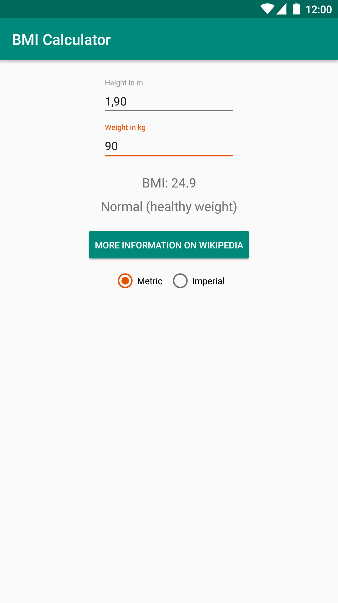
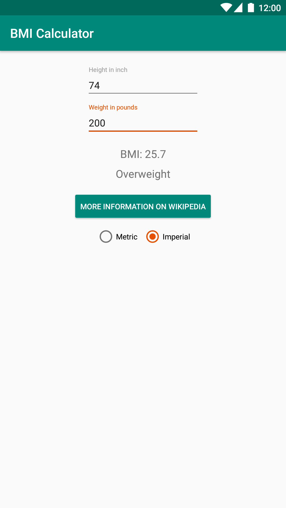

# BMI calculator app for Android

 

## Translations

Translations are managed via [Crowdin](https://crowdin.com/project/characterdog-bmi-calculator).

## License

Published under [GNU General Public License v3.0 or later](https://spdx.org/licenses/GPL-3.0-or-later.html).
